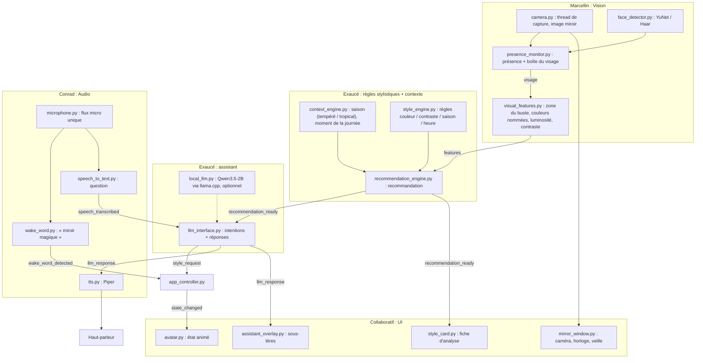

```mermaid
flowchart TD
    subgraph VISION [Marcellin : Vision]
        A1[camera.py : thread de capture, image miroir]
        A2[face_detector.py : YuNet / Haar]
        A4[presence_monitor.py : présence + boîte du visage]
        A3[visual_features.py : zone du buste, couleurs nommées, luminosité, contraste]
    end

    subgraph INTELLIGENCE [Exaucé : règles stylistiques + contexte]
        B1["context_engine.py : saison (tempéré / tropical), moment de la journée"]
        B2[style_engine.py : règles couleur / contraste / saison / heure]
        B3[recommendation_engine.py : recommandation]
    end

    subgraph AI [Exaucé : assistant]
        C1[llm_interface.py : intentions + réponses]
        C2[local_llm.py : Qwen3.5-2B via llama.cpp, optionnel]
    end

    subgraph AUDIO [Conrad : Audio]
        D0[microphone.py : flux micro unique]
        D1[wake_word.py : « miroir magique »]
        D2[speech_to_text.py : question]
        D3[tts.py : Piper]
    end

    subgraph UI [Collaboratif : UI]
        E1[mirror_window.py : caméra, horloge, veille]
        E2[avatar.py : état animé]
        E3[assistant_overlay.py : sous-titres]
        E4[style_card.py : fiche d'analyse]
    end

    D0 --> D1
    D0 --> D2
    D1 -->|wake_word_detected| CTRL[app_controller.py]
    D2 -->|speech_transcribed| C1
    C1 -->|style_request| CTRL
    A1 --> A4
    A2 --> A4
    A4 -->|visage| A3
    A3 -->|features| B3
    B1 --> B3
    B2 --> B3
    B3 -->|recommendation_ready| C1
    C2 -.-> C1
    C1 -->|llm_response| D3
    C1 -->|llm_response| E3
    B3 -->|recommendation_ready| E4
    A1 --> E1
    CTRL -->|state_changed| E2
    D3 --> Speaker[Haut-parleur]
```
